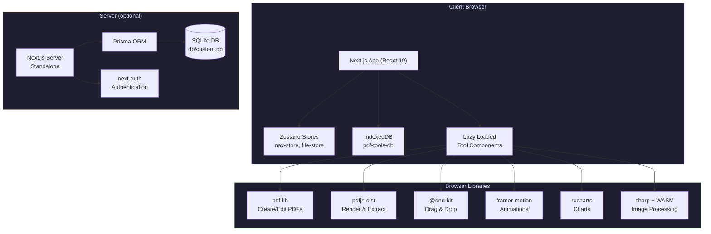
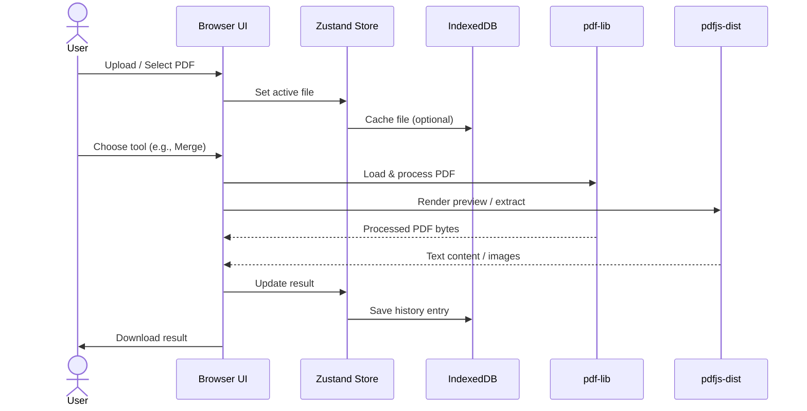

<div align="center">

# 📄 **PDF Tools — Free Online PDF Editor**


**31+ browser-based PDF tools — 100% free, no uploads, no registration, no limits.**

[Features](#features) • [Tools](#pdf-tools) • [Getting Started](#getting-started) • [Architecture](#system-architecture) • [Dev Stack](#dev-stack) • [Configuration](#configuration)

---

</div>

## ✨ **Features**

### 🔒 **Privacy-First**
- **100% Browser-Based** — All processing happens client-side using `pdf-lib` and `pdfjs-dist`
- **Zero Uploads** — Your files **never** leave your device
- **No Registration** — No accounts, no tracking, no data collection
- **Works Offline** — Fully functional without an internet connection

### ⚡ **Performance**
- **Lightning Fast** — Powered by WASM-optimized PDF libraries
- **Lazy Loaded** — Tool components loaded on-demand for instant startup
- **IndexedDB Storage** — Persistent file and history storage in-browser
- **Dark Mode** — Full theme support via `next-themes`

### 🤖 **AI-Powered Tools**
- **OCR PDF** — Extract text from scanned documents
- **PDF to Markdown** — AI-driven intelligent conversion
- **Summarize PDF** — Document summarization
- **PDF to DOCX** — Convert to Word format

---

## 🛠️ **PDF Tools (31+)**

### Convert
| Tool | Description |
|------|-------------|
| **PDF to JPG** | Convert PDF pages to high-quality JPG images |
| **JPG to PDF** | Create a PDF from multiple JPG images |
| **PDF to PNG** | Convert PDF pages to PNG images |
| **PDF to Text** | Extract plain text from PDF documents |
| **PDF to HTML** | Convert PDF pages to structured HTML |
| **PDF to Markdown** | AI-powered PDF-to-Markdown conversion |
| **PDF to DOCX** | AI-powered PDF-to-Word conversion |
| **OCR PDF** | Optical character recognition for scanned PDFs |
| **View PDF** | In-browser PDF viewer with zoom & pan |

### Organize
| Tool | Description |
|------|-------------|
| **Merge PDF** | Combine multiple PDFs into one document |
| **Split PDF** | Split a PDF into multiple files by page ranges |
| **Rotate PDF** | Rotate individual or all pages |
| **Organize PDF** | Reorder, delete, and rearrange pages |
| **Extract Pages** | Extract specific pages into a new PDF |
| **Delete Pages** | Remove unwanted pages |
| **Rearrange PDF** | Drag-and-drop page reordering |
| **Crop PDF** | Crop margins and resize pages |
| **Page Numbers** | Add page numbers to documents |
| **Header & Footer** | Add custom headers and footers |
| **Edit Metadata** | View and edit PDF document metadata |
| **Fill Form** | Fill interactive PDF form fields |

### Security
| Tool | Description |
|------|-------------|
| **Protect PDF** | Add password protection |
| **Unlock PDF** | Remove password protection |
| **Watermark PDF** | Add text/image watermarks |
| **Redact PDF** | Permanently redact sensitive text |
| **Sign PDF** | Add digital signatures |

### Optimize
| Tool | Description |
|------|-------------|
| **Compress PDF** | Reduce file size while maintaining quality |
| **Flatten PDF** | Flatten form fields and annotations |
| **Repair PDF** | Rebuild and fix corrupted PDFs |
| **Compare PDF** | Side-by-side PDF comparison |
| **Summarize PDF** | AI-powered document summarization |

---

## 🚀 **Getting Started**

### Prerequisites
- [Bun](https://bun.sh) v1.3+ (runtime & package manager)
- Node.js 20+ (optional, for other tooling)

### Installation

```bash
# Clone the repository
git clone <repo-url>
cd ls-pdf-tool

# Install dependencies
bun install

# Set up environment
cp .env.example .env.local   # (if available)

# Push database schema (SQLite via Prisma)
bun run db:push

# Start development server
bun run dev
```

Open [http://localhost:3000](http://localhost:3000) in your browser.

### Build for Production

```bash
bun run build
bun run start
```

Builds a standalone `./next/standalone/` directory for deployment.

### Database Commands

```bash
bun run db:push      # Push schema to database
bun run db:generate  # Generate Prisma client
bun run db:migrate   # Create a new migration
bun run db:reset     # Reset database
```

---

## 🏗️ **System Architecture**



### Architecture Highlights

- **Client-Side Processing**: All PDF operations (merge, split, compress, watermark, etc.) execute entirely in the browser via `pdf-lib` and `pdfjs-dist`
- **Server as Optional Backend**: Next.js standalone server + Prisma + SQLite for optional features (auth, persistence)
- **Lazy Loading**: Each tool is a separate code-split chunk loaded on demand
- **State Management**: Zustand stores for navigation + file state
- **Client Storage**: IndexedDB for file caching and operation history
- **UI Component System**: Radix UI primitives + shadcn/ui components + Tailwind CSS v4

### Data Flow



---

## 📊 **Stats at a Glance**

| Metric | Value |
|--------|-------|
| Tools | **31+** |
| Categories | 4 (Convert, Organize, Security, Optimize) |
| AI-Powered Tools | 4 |
| Processing | **100% Browser** |
| Price | **Free Forever** |
| User Base | **50K+** users |

---

## 💻 **Dev Stack**

### Frontend
| Technology | Version | Purpose |
|------------|---------|---------|
| **Next.js** | ^16.1.1 | React framework with standalone output |
| **React** | ^19.0.0 | UI library |
| **TypeScript** | ^5 | Type safety |
| **Tailwind CSS** | ^4 | Utility-first styling |
| **shadcn/ui** | latest | Radix-based component system |
| **Zustand** | ^5.0.6 | State management |
| **TanStack React Query** | ^5.82.0 | Server state management |
| **Framer Motion** | ^12.23.2 | Animations |
| **lucide-react** | ^0.525.0 | Icon library |
| **next-themes** | ^0.4.6 | Theme (dark/light) |

### PDF & Data Processing
| Library | Purpose |
|---------|---------|
| **pdf-lib** | Create, modify, and manipulate PDF documents |
| **pdfjs-dist** | Render and extract text from PDFs |
| **sharp** | Image processing via WASM |
| **JSZip** | ZIP file creation |
| **file-saver** | Client-side file download |

### Backend & Database
| Technology | Purpose |
|------------|---------|
| **Next.js Standalone** | Production server |
| **Prisma** | ORM for database access |
| **SQLite** | Local file-based database |
| **next-auth** | Authentication |
| **Caddy** | Reverse proxy (Caddyfile provided) |

### UI & Developer Experience
| Library | Purpose |
|---------|---------|
| **Radix UI** | Accessible primitives (30+ packages) |
| **react-hook-form + zod** | Form validation |
| **@dnd-kit** | Drag-and-drop |
| **cmdk** | Command palette / search |
| **date-fns** | Date utilities |
| **recharts** | Charts & statistics |
| **react-markdown** | Markdown rendering |
| **sonner** | Toast notifications |
| **embla-carousel** | Carousel/slider |

---

## ⚙️ **Configuration**

### Next.js Config (`next.config.ts`)

```typescript
const nextConfig: NextConfig = {
  output: "standalone",     // Standalone deployment
  typescript: {
    ignoreBuildErrors: true,
  },
  reactStrictMode: false,
};
```

### Tailwind Config (`tailwind.config.ts`)
Custom theme with shadcn/ui design tokens, dark mode via class strategy.

### Prisma Schema (`prisma/schema.prisma`)
- **Provider**: SQLite
- **Models**: `User`, `Post` (extendable for tool usage tracking)

### Caddyfile
Reverse proxy configuration for production deployment with automatic HTTPS.

### Environment Variables
| Variable | Description |
|----------|-------------|
| `DATABASE_URL` | SQLite database path (e.g., `file:./db/custom.db`) |

---

## 📂 **Project Structure**

```
├── src/
│   ├── app/          # Next.js App Router pages & layout
│   ├── components/   # Reusable UI components (shadcn/ui)
│   │   └── ui/       # Primitive components
│   ├── lib/          # Utilities, tools definition, DB, IndexedDB
│   ├── tools/        # Individual PDF tool components (lazy loaded)
│   └── store/        # Zustand stores
├── prisma/
│   └── schema.prisma # Database schema (SQLite)
├── public/           # Static assets (logo, robots.txt)
├── db/               # SQLite database file
├── agent-ctx/        # Agent context files (development notes)
├── download/         # QA screenshots
├── mini-services/    # Microservices (optional)
└── next.config.ts    # Next.js configuration
```

---

<div align="center">

**Built with ❤️ using Next.js, React, TypeScript, and Tailwind CSS**

*All processing runs locally in your browser. No data is ever uploaded to any server.*

</div>
